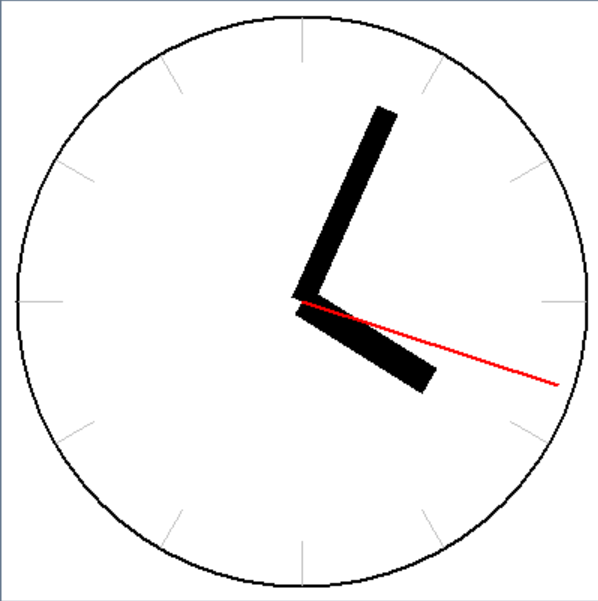

# Analog Clock

A simple analog clock application built with Python and PySimpleGUI.

## Screenshot

  

## Features

- Displays an analog clock in real time
- Updates every 100 ms
- Draws hour, minute and second hands
- Draws hour marks using trigonometry

## Technologies

- Python
- PySimpleGUI
- Tkinter Canvas

## What I learned

This project helped me understand:

- How to update a GUI repeatedly
- How to draw shapes on a Canvas
- How to calculate positions with trigonometric functions
- How to split a program into reusable functions

## Future Improvements

- Play an alarm every hour
- Add a background image
- Display a digital clock
